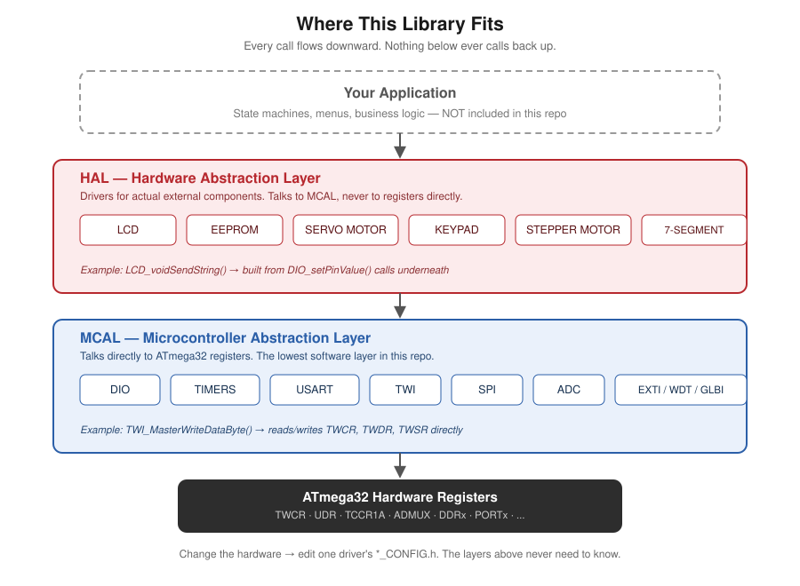

<p align="center">
  
</p>

# AVR Driver Library

A layered library of **MCAL** (Microcontroller Abstraction Layer) and **HAL** (Hardware Abstraction Layer) drivers for the **ATmega32** microcontroller, written in C. It was built during an embedded systems training program (ITI AVR track) and later became the driver foundation for a full graduation project — a [fingerprint-based biometric access control system](#).


If you're new to this repo: this is **driver-level code**, not a full application. It's the layer that sits between raw AVR registers and whatever product you're building — it doesn't know or care what the end application does; it just gives you a clean, tested API to talk to timers, communication buses, and common external components (displays, memory, sensors, motors).

---

## 1. What's in this repo

<p align="center">
  
</p>

| Layer | Role |
|---|---|
| **MCAL** | Talks directly to ATmega32 registers — ports, timers, USART, I²C, SPI, ADC, external interrupts, the watchdog |
| **HAL** | Built on top of MCAL — drivers for actual external components: an LCD, an EEPROM chip, a servo motor, a keypad, a stepper motor, a seven-segment display |

A typical **application layer** (not included in this repo — see [Where this fits](#3-where-this-fits-application-layer-context) below) sits on top of both: it calls HAL/MCAL functions to implement actual product behavior — state machines, menus, business logic — without ever touching a register directly. That separation is the entire point of this library: change the hardware, and only the driver + its `_CONFIG.h` need to change, not the application code built on top of it.

---

## 2. Hardware this library targets

| Component | Notes |
|---|---|
| **ATmega32** | Target MCU for every driver in this repo |
| **HD44780-compatible character LCD** | Default config: 8-bit mode, 16×2, control pins on PORTB, data pins on PORTA (fully reconfigurable via `LCD_CONFIG.h`, including 4-bit mode) |
| **24Cxx-series I²C EEPROM** | External non-volatile storage, accessed over the TWI driver |
| **Hobby servo motor (e.g. SG90-class)** | Angle range 0°–180°, driven via Timer1 PWM at 50Hz |
| **4×4 matrix keypad** | Default wiring: rows + columns on PORTD |
| **4-pin unipolar stepper motor (e.g. 28BYJ-48-class, via ULN2003 driver board)** | Step/direction control, default wiring on PORTD |
| **Single-digit seven-segment display** | Simple digit-to-segment lookup driver |

All pin assignments above are **defaults** set in each module's `_CONFIG.h` — none of it is hardcoded into the driver logic, so rewiring a component to different pins means editing one config file, not the driver source.

---

## 3. Where this fits (application-layer context)

This library doesn't include an application layer — it's intentionally kept as a standalone, reusable driver set. For an example of a **full product built on top of a driver stack like this one**, see the [Fingerprint-Based Security and Control System](#) — a separate repository where the EEPROM, LCD, Timer1, DIO, and USART drivers were extended and hardened (dynamic sparse-array EEPROM management, Timer1 dual-use for PWM + timekeeping, binary-safe UART framing for a fingerprint sensor) to support a real biometric access-control application with a finite state machine, menu-driven UI, and multi-layered security logic.

---

## 4. Driver reference

### MCAL — Microcontroller Abstraction Layer

| Module | Covers | Key API surface |
|---|---|---|
| **DIO** | Pin/port direction, read, write, toggle, pull-up/pull-down control | `DIO_setPinDirection`, `DIO_setPinValue`, `DIO_getPinValue`, `DIO_togglePinValue`, port-level equivalents |
| **TIMERS** (Timer0 / Timer1 / Timer2) | Normal, CTC, and PWM modes; interrupt-driven via registered callbacks | `TIMERx_voidInit`, `TIMERx_voidSetCallBack`, compare-match and overflow control; Timer1 additionally supports 16-bit Compare A/B and Input Capture (ICU) |
| **USART** | Interrupt- or polling-based serial I/O | `USART_voidSendChar/String/Number`, `USART_u8ReceiveChar`, `USART_voidReceiveString`, per-event (RX/TX/UDRE) callback registration, `USART_u8ReadERROR` for frame/parity/overrun error checking |
| **TWI (I²C)** | Full master-mode I²C | `TWI_SendStartCondition`, `TWI_SendRepeatedStartCondition`, `TWI_SendSlaveAddressWrite/Read`, `TWI_MasterWriteDataByte`, `TWI_MasterReadDataByteAck/Nack`, `TWI_u8GetStatusCode` for protocol-level status inspection |
| **SPI** | Master-mode synchronous transfer | `SPI_u8TransmitDataSync`, interrupt callback support |
| **ADC** | Single-channel analog conversion | `ADC_voidStartConversion`, `ADC_voidSetCallBack`, `ADC_u8GetDigitalValue` |
| **EXTI** | External interrupt configuration | `EXTI_voidSetMODE`, `EXTI_voidSetCallBack`, per-interrupt enable/disable |
| **WATCHDOG** | System reset safety net | `WDT_voidEnable/Disable`, `WDT_voidClearResetFlag` |
| **INTERRUPTS (GLBI)** | Global interrupt master switch | `GLBI_voidEnableGlobal` / `GLBI_voidDisableGlobal` (`sei`/`cli` wrapper) |

### HAL — Hardware Abstraction Layer

| Module | Covers | Key API surface |
|---|---|---|
| **LCD** | Character LCD control | `LCD_voidInit`, `LCD_voidClearScreen`, `LCD_voidGoToPosition`, `LCD_voidSendChar/String/Number` |
| **EEPROM** | External I²C EEPROM | Byte/string/page-level read & write, `EEPROM_uddtUpdateByte`, `EEPROM_uddtDeleteByte`, `EEPROM_uddtEraseEEPROM`, plus a simple name-manager layer (`EEPROM_uddtManagerInit/SaveName/ReadName`) for indexed record storage |
| **SERVO_MOTOR** | PWM angle control | `SERVO_voidInit`, `SERVO_voidSetAngle` |
| **KEYPAD** | Matrix keypad scanning | `KEYPAD_voidInit`, `KEYPAD_getPressedKey` |
| **STEPPER_MOTOR** | Step/direction control | `STEPPER_voidInit`, `STEPPER_voidRotate`, `STEPPER_voidStop` |
| **Seven_Segment** | Single-digit display | `SSD_voidInit`, `SSD_displayDigit` |

---

## 5. Design conventions

**File split per driver.** Every module is split into up to five files:

| File | Purpose |
|---|---|
| `*_INT.h` / `*_INIT.h` | Public API — the only header application code should include |
| `*_PROG.c` | Implementation |
| `*_CONFIG.h` | Compile-time tunables (clock speed, modes, pin selection, etc.) |
| `*_PRIVATE.h` | Internal macros/constants not exposed to callers |
| `*_REG.h` | Register-level memory-mapped addresses for the peripheral |

> **Naming note:** most modules use `_INT.h` for their public header. `DIO`, `KEYPAD`, and `STEPPER_MOTOR` use `_INIT.h` instead — a naming inconsistency left over from how the drivers were originally written during training, kept as-is here rather than "cleaned up" after the fact.

**Error handling.** Two conventions are used across the library, depending on what the driver needs to report:

- **`Std_ReturnType`** (defined in `STD_TYPES.h` as `E_OK` / `E_NOT_OK`) — a simple success/failure return used by protocol-level operations, e.g. `TWI_SendStartCondition()` returning `E_NOT_OK` if the bus doesn't respond as expected.
- **Driver-specific error enums** — used where a caller needs to know *what* went wrong, not just *that* something did. The EEPROM driver's `EEPROM_ErrorType` is the clearest example: it distinguishes `EEPROM_START_ERROR`, `EEPROM_CHIP_ADDRESS_ERROR`, `EEPROM_MEMORY_ADDRESS_ERROR`, `EEPROM_DATA_WRITE_ERROR`, `EEPROM_DATA_READ_ERROR`, and `EEPROM_NULL_POINTER_ERROR` as distinct return values, so calling code can react differently to a bus fault versus a bad address versus a null pointer.

**Callback-based interrupts.** Every interrupt-capable peripheral (Timers, USART, TWI, SPI, ADC, EXTI) exposes a `_voidSetCallBack()`-style function. The ISR itself lives inside the driver and just invokes whatever function pointer the application registered — application code never touches `ISR(...)` directly, which keeps interrupt vector ownership inside the driver layer.

---

## 6. Usage example

```c
#include "MCAL/DIO_INIT.h"
#include "MCAL/TIMERS/TIMER0_INT.h"
#include "HAL/LCD/LCD_INIT.h"

int main(void) {
    DIO_setPinDirection(DIO_PORTC, DIO_PIN2, DIO_PIN_OUTPUT);
    LCD_voidInit();
    LCD_voidSendString((uint8_t*)"Hello, AVR!", 11);

    while (1) {
        DIO_togglePinValue(DIO_PORTC, DIO_PIN2);
    }
}
```

Each driver's `_CONFIG.h` should be set to match your actual wiring and clock speed before building.

---

## 7. Toolchain

- **MCU:** ATmega32
- **Compiler:** avr-gcc, built and tested with `-Os` (size optimization)
- **IDE:** Eclipse (AVR plugin) — any avr-gcc-based toolchain will work

---

## 8. License

MIT — see [LICENSE](LICENSE). Use any part of this, in full or in pieces, for your own projects.

---

## Appendix: A Hand-Rolled Mini-RTOS (`OS/RTOS/`)

`OS/RTOS/` is a small cooperative, time-triggered task scheduler — four files, one Timer0 interrupt, and a fixed-size task table. It wasn't written as another driver to build on top of; it was written as a learning exercise, to understand what a scheduler is actually doing mechanically (delay counters, periodic dispatch, a task control block) before moving on to a real RTOS (FreeRTOS).

**What it does:** `RTOS_u8CreateTask()` registers a function pointer with a period and an initial delay; a Timer0 Compare-Match interrupt ticks a shared scheduler function that decrements each task's counter and calls it once that counter hits zero.

**Scope, on purpose:** this module is kept exactly as it was when it served its purpose — it isn't wired into this repo's current `TIMER0_CONFIG.h` (Timer0 is configured for a different job elsewhere in this library) and it isn't a hardened, production scheduler. Most notably, tasks run directly inside the ISR rather than being dispatched from the main loop — the simpler, more naive version of a time-triggered cooperative scheduler, before splitting "tick" from "dispatch" the way a proper implementation (or FreeRTOS itself) does. That gap is intentional to leave visible: it's a big part of *why* this was worth writing by hand first.

If you're digging into this repo to learn from it rather than build on it, this folder is a good place to see a scheduler's core mechanism stripped down to its simplest possible form.

